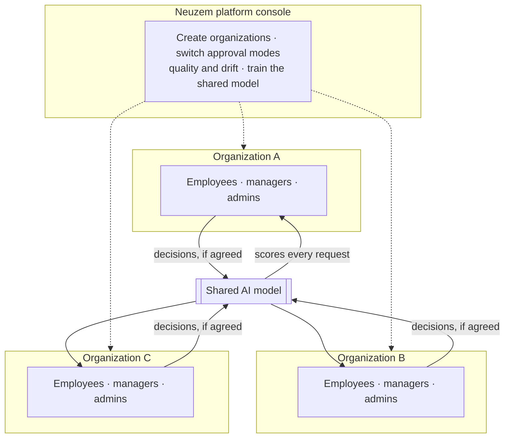
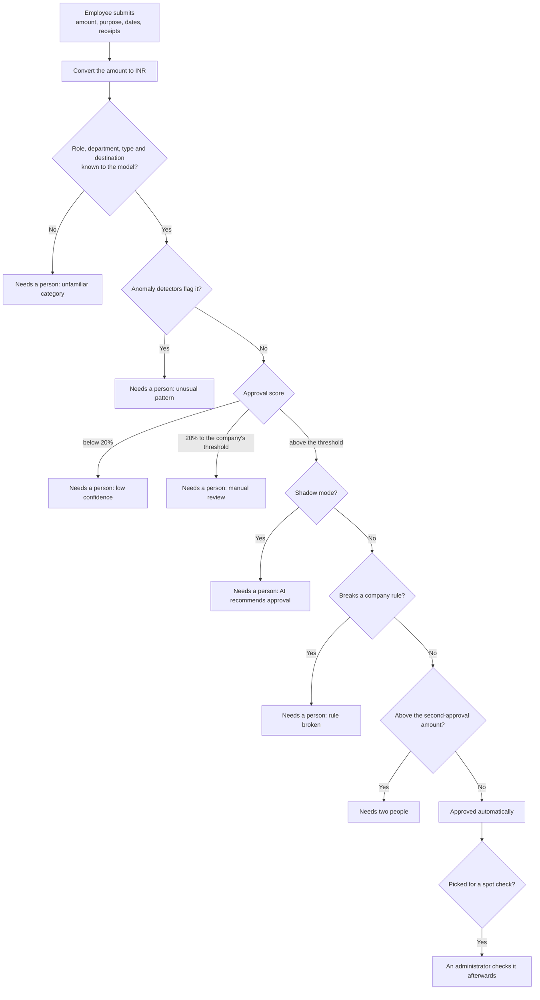
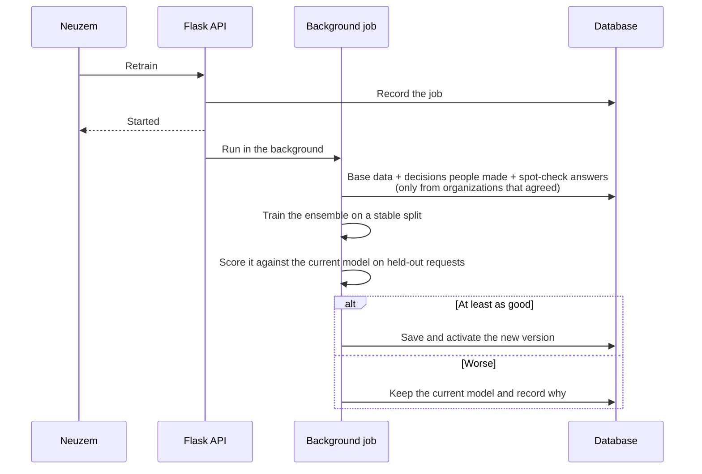

# Advanced Approval Management System (AAMS)

**AI-assisted expense and travel approvals, for many companies on one system.** Employees submit requests, a machine-learning ensemble scores each one, the routine ones can be approved in seconds and anything risky, unusual or unfamiliar goes to a person. Every decision a person makes is measured against what the AI would have done, and the model learns from those decisions.

[](https://github.com/Mithilesh017/advanced-approval-system/actions/workflows/tests.yml)


> [!IMPORTANT]
> **Proprietary software of [Neuzem](https://neuzem.com). All rights reserved.**
> This repository, its source code, trained models and design are the property of Neuzem. No licence is granted to copy, run, modify, deploy or distribute any part of it. See [Licence](#licence).

---

## The idea

Manual approval queues are slow. Fixed rules are brittle and easy to game. AAMS puts a model between the two and keeps a person in charge of anything that matters:

- **Routine requests move immediately.** A request that closely matches spending a company has approved before can be approved without waiting for anyone.
- **Anything doubtful reaches a person, with the reason attached.** Unusual amounts, anomalous patterns, low confidence, categories the model has never seen, and anything that breaks a company rule.
- **The AI has to earn its autonomy.** A new company starts in shadow mode, where the AI only recommends and a person decides everything. It is allowed to approve on its own only once that company's own numbers show it is good enough.
- **Every automatic approval can still be checked.** A random share of them is put in front of a person afterwards, which is the only honest measure of decisions nobody watched.

## Many companies, one system

Each organization is a sealed box. People, requests, receipts, rules and history belong to exactly one organization, and every query is scoped to it — asking for another organization's request returns "not found", not "forbidden", so nothing leaks even by implication.

What crosses the boundary is the model, and only with permission: a company can agree to let its decisions train the shared AI. That agreement is a per-organization setting, and requests from a company that has not agreed are never used for training.

**Neuzem** runs the platform from a separate console. The platform owner belongs to no organization and cannot see any organization's requests, receipts or people — only the settings, the counts, and how well decisions are going.



## How a request is decided



Each score comes with SHAP values showing which fields pushed it up or down. Administrators see them; employees see only the outcome, so nobody can map the model's boundaries by resubmitting variations of a request.

## Who does what

**Employees** submit requests with a business purpose, the expense date and any trip dates, and up to five receipts. They see their own history and outcomes, and can add receipts to a request that is still open.

**Managers** are ordinary employees with people reporting to them. A request that needs a person waits for the submitter's manager, who approves or rejects it from a Team Approvals page and can open only their own team's receipts and history.

**Administrators** see every request in their organization, can decide any of them (useful when a manager is away), reopen a decision, run the spot checks, manage accounts and assign managers.

**Super Admins** do everything administrators do, plus approve administrator accounts, set the approval thresholds and company rules, and download the organization's data.

**Neuzem's platform owner** creates organizations, switches a company between shadow mode and automatic approval, watches decision quality and drift, retrains the shared model, and closes a company that leaves.

| Capability | Employee | Manager | Admin | Super Admin | Neuzem |
| --- | :---: | :---: | :---: | :---: | :---: |
| Submit requests, see own history | Yes | Yes | Yes | Yes | |
| Decide requests waiting for them | | Yes | | | |
| See and decide every request in the company | | | Yes | Yes | |
| Reopen a decision | | | Yes | Yes | |
| Answer spot checks | | | Yes | Yes | |
| Approve employee accounts, assign managers | | | Yes | Yes | |
| Approve administrator accounts | | | | Yes | |
| Set thresholds, rules and the second-approval amount | | | | Yes | |
| Download the organization's data | | | | Yes | |
| Create organizations, switch approval mode | | | | | Yes |
| Retrain the shared model, roll back a version | | | | | Yes |
| See another organization's requests or people | | | | | **No** |

## People in the loop

**The manager decides first.** Administrators assign a manager to each employee; only a Super Admin sets an administrator's manager. Self-management and reporting loops are refused. Without a manager, requests go to the administrators. Changing, clearing or deleting a manager moves whatever was waiting for them.

**Large amounts need two people.** A Super Admin sets an amount above which a request needs two approvals. Such a request is never approved by the AI alone: the manager approves first, then a different administrator gives the second approval. The same person can never give both, and reopening starts the approvals again.

**Whoever must decide is told by email** — the manager, the administrators, or the second approver. A failed send never affects a decision that was already saved.

**Rejecting and reopening need a reason**, which is saved in the request's history.

## Company rules

Rules are set per organization and are checked before the AI's own decision. A broken rule always sends a request to a person; rules never approve or reject on their own.

| Rule | What it catches |
| --- | --- |
| Amount limit | Anything above an amount the company sets, per request type or overall |
| Duplicate request | The same person asking for the same thing again within a set number of days |
| Receipt required | No receipt attached above an amount the company sets |
| Always review | A department, role, type or destination that must always be seen by a person |

## The record

Every decision writes an entry to an append-only history: who did it, when, what changed, the reason they gave, and — for a submission — the model version, the score, the thresholds in force, the rules broken and the SHAP explanation. The database itself refuses updates and deletes on that table, so the history cannot be edited after the fact, by anyone, including the application.

The single exception is closing an organization, described below.

## Measuring the AI

A model that nobody measures is a claim, not a system. Every number here comes from the company's own requests.

**Spot checks.** Nobody sees a request the AI approves alone, so a share of them — 5% by default, which a Super Admin can raise but not lower — is put on a Spot Checks page for an administrator to look at afterwards. They answer "right" or "wrong"; a wrong answer needs a reason. The request itself is not held up.

**Decision quality.** For every request a person decided, what the AI recommended is compared with what the person chose:

- how often they agreed
- how often the AI would have approved something a person refused — the number that matters most, because in automatic mode those go through unseen
- how often it asked for a review that turned out to be unnecessary
- what the spot checks found, how many requests came in, and how long people take to decide

Percentages stay hidden until there are enough decisions to mean something, so a handful of requests never looks like a verdict.

**The quality gate.** A company cannot be switched to automatic approval until its own last 90 days pass: at least 20 decisions made by people, at least 85% agreement, at most 5% that the AI would have let through, and at most 10% of checked automatic approvals found wrong. A company that is not ready is refused with the failing checks named. Neuzem can overrule the gate for a pilot, and the history records that it was forced and what was failing. Going back to shadow mode is never blocked.

**Drift.** The last twelve weeks sit side by side: requests, how many needed a person, how many used a category the model has never seen, how many looked unusual, and the average score. When the newest week stops looking like the weeks before it, the page says so in plain words. A week too small to judge percentages on still reports a sudden rush or a sudden silence.

**Fairness.** Approvals and reviews are grouped by department and by role. A group more than fifteen points away from the company as a whole is named; a group too small to judge is shown but never flagged. A gap is a reason to look, not proof of unfairness, and the page says so.

## How the model learns



- **It learns from people, not from itself.** Automatic approvals are excluded, so the model never reinforces its own mistakes — except where a person spot-checked one, and then it learns exactly what it got wrong. Real decisions are weighted more heavily than base data.
- **An amount is judged against that company's own normal.** Alongside the rupee amount, each request carries how big it is compared with the middle amount of its organization's recent requests. That is what lets one shared model learn from a small firm and a large one at the same time. A company too new to have a normal falls back to the base data.
- **Fair comparisons.** Each record is assigned to training or evaluation by a stable hash, so a model is never scored on rows it was trained on.
- **A worse model never goes live.** Versions are stored in the database, every server process picks up the active one within thirty seconds, and any earlier version can be restored.
- **New vocabulary is picked up automatically.** A job role or destination a company starts using appears in the next trained model. The request form still offers only the shared base vocabulary, so one company's values are never shown to another.

## Leaving

**Taking the data.** A Super Admin can download one file holding their organization's settings, its people, every request with its decision and scores, what each receipt is, the full history in order, the rules and the spot-check answers — plus the receipt files exactly as they were uploaded, and a plain README describing each part. Passwords, join links and every other organization's data stay out.

**Closing a company.** When a company leaves, Neuzem closes it. Everything that names a person goes: accounts and passwords, receipt files, employee names and IDs, the purpose written on each request, the company's rules, and its whole history — replaced by one line recording who closed it and what was removed. The old join link stops working.

What stays is each decision with nobody's name on it — role, department, request type, destination, amount, outcome — which is what the model learns from and what the company's own agreement covers. Closing does not grant that agreement: a company that never shared its data is still not learned from.

Erasing that history is the one operation allowed past the append-only guard, which is lifted and put back inside the same transaction.

## Model performance

The bundled base model, on 4,635 held-out records it was not trained on:

| Metric | Score |
| --- | --- |
| ROC-AUC | 0.9975 |
| Accuracy | 99.1% |
| F1-score | 0.9954 |

On the same records the thresholds route **92.1%** to automatic approval, **6.0%** to low-confidence escalation and **1.9%** to manual review.


> That base dataset combines synthetic corporate expense records with a public loan-approval dataset mapped to the same schema, so these scores describe a benchmark, not a promise about any real company. What a specific organization gets is measured on its own decisions on the Decision Quality page, which is the number that counts.

## Data and privacy

- **Receipts live in the database**, not on disk, so they survive redeploys. A file's type is read from its content, never from its name; only PDF, JPG and PNG are accepted, at most five files of 5 MB each. Images open inline, PDFs download, and neither can run as code inside the site.
- **Receipts open only for the employee, their manager and their administrators.**
- **Employees see outcomes, not internals.** Scores, escalation reasons and thresholds stay with administrators.
- **Training data is anonymous by nature.** The model uses role, department, request type, destination and amount. It never sees names, emails, employee IDs or the text of a purpose.
- **Consent is per organization**, set when the organization is created and changeable later, and it is never turned on by anything the system does on its own.

## Security

- Sessions are JWTs in HttpOnly, SameSite cookies, marked Secure in production; logging out clears them server-side
- Role, account status and organization are re-read on every request, so removing an account, changing a role or pausing an organization takes effect immediately rather than when the session expires
- Every organization-scoped query filters by organization, and cross-organization access returns "not found"
- Account setup and password reset use single-use, expiring links whose tokens are stored only as SHA-256 hashes; passwords are salted and hashed with Werkzeug
- Rate limiting protects login, registration, password reset, prediction, retraining and data export, and sees real client IPs behind the host's proxy
- Server-side validation covers emails, currencies, amounts, dates, purposes and uploads; user text is escaped in emails and rendered as plain text in dialogs
- The audit log is append-only, enforced by database triggers rather than by application code
- Internal errors are logged on the server; clients receive generic messages

## Tech stack

| Layer | Technologies |
| --- | --- |
| Backend | Flask 3.1, Flask-JWT-Extended, Flask-Limiter, Flask-CORS, Gunicorn |
| Machine learning | XGBoost, scikit-learn (Isolation Forest, One-Class SVM), SHAP, pandas, NumPy, joblib |
| Data | PostgreSQL in production, SQLite for local work; the same code path serves both |
| Frontend | React 18, DataTables, Chart.js, SweetAlert2, Font Awesome |
| Email | SMTP or the SendGrid HTTP API, sent in background threads |
| Tests | pytest — 276 tests, run against both SQLite and PostgreSQL on every push |

## What is in the repository

```text
advanced-approval-system/
├── main.py                    # The whole backend: auth, organizations, requests, scoring,
│                              # rules, receipts, measurement, export and the platform console
├── model_pipeline.py          # Feature building, training, evaluation and the quality check
├── email_service.py           # Transactional email
├── ensemble_ai_model.pkl      # The bundled model with its encoders, base data and metrics
├── index.html                 # Login, access requests, account setup, password reset
├── user.html                  # Employee portal, including Team Approvals for managers
├── admin.html                 # Administrator portal: requests, users, settings, spot checks,
│                              # decision quality, drift and fairness
├── platform.html              # Neuzem console: organizations, quality, the AI model
├── styles.css                 # One shared design system for every page
└── tests/                     # 276 tests across both databases
```

## What the API covers

<details>
<summary>Accounts and sessions</summary>

| Endpoint | Access |
| --- | --- |
| `POST /api/auth/login`, `POST /api/auth/logout` | Public |
| `POST /api/auth/request_access`, `GET /api/auth/join_info` | Public, via an organization's join link |
| `POST /api/auth/setup_password`, `POST /api/auth/request_password_reset`, `POST /api/auth/reset_password`, `GET /api/auth/reject_reset` | Emailed single-use links |
| `GET /api/auth/get_profile`, `POST /api/auth/update_profile` | Signed in |
| `GET /api/auth/users`, `GET /api/auth/pending_users`, `POST /api/auth/approve_user`, `POST /api/auth/reject_user`, `POST /api/auth/delete_user`, `POST /api/auth/set_manager` | Admin, Super Admin for administrators |

</details>

<details>
<summary>Requests, receipts and decisions</summary>

| Endpoint | Access |
| --- | --- |
| `POST /api/predict` | Signed in |
| `GET /api/model/form_options` | Signed in |
| `GET /api/auth/my_requests` | Own requests |
| `GET /api/auth/team_requests` | Managers |
| `GET /api/auth/all_requests`, `GET /api/auth/pending_approval_requests` | Admin |
| `POST /api/auth/approve_request`, `POST /api/auth/reject_request` | The assigned manager or an admin |
| `POST /api/auth/reopen_request` | Admin |
| `GET /api/auth/request_history` | Admin and the submitter's manager |
| `POST /api/auth/add_receipts`, `GET /api/auth/request_receipts`, `GET /api/auth/receipt` | The employee, their manager and their admins |

</details>

<details>
<summary>Company settings and measurement</summary>

| Endpoint | Access |
| --- | --- |
| `GET /api/auth/organization` | Signed in; settings only for admins |
| `POST /api/auth/update_approval_settings` | Super Admin |
| `GET /api/auth/policy_rules`, `POST /api/auth/create_policy_rule`, `POST /api/auth/update_policy_rule` | Super Admin |
| `GET /api/auth/spot_checks`, `POST /api/auth/review_spot_check` | Admin |
| `GET /api/auth/decision_quality`, `GET /api/auth/monitoring`, `GET /api/auth/fairness` | Admin |
| `GET /api/auth/export` | Super Admin |

</details>

<details>
<summary>The Neuzem platform console</summary>

| Endpoint | Access |
| --- | --- |
| `GET /api/platform/organizations`, `POST /api/platform/create_organization`, `POST /api/platform/update_organization`, `POST /api/platform/close_organization` | Platform owner |
| `GET /api/platform/decision_quality` | Platform owner — numbers only, never the requests behind them |
| `GET /api/platform/model/info`, `POST /api/platform/model/retrain`, `GET /api/platform/model/jobs/latest`, `GET /api/platform/model/versions`, `POST /api/platform/model/activate` | Platform owner |

</details>

## Known limitations

- Exchange rates are fixed values in the code rather than a live feed.
- The frontend compiles JSX in the browser for zero-build simplicity. A bundler would load faster for large deployments.
- Retraining runs in a background thread inside the web process. That is fine at this size; a busy platform would want a separate worker.
- Single sign-on is not supported. Accounts are email and password, with approval by an administrator.

## Licence

**Proprietary. Copyright © 2026 Neuzem. All rights reserved.**

This software — its source code, trained models, datasets, documentation and design — is the exclusive property of Neuzem. No licence or right is granted, by implication, estoppel or otherwise, to copy, clone, install, run, modify, merge, publish, sublicense, sell or distribute any part of it, or to create derivative works from it, without prior written permission from Neuzem.

Viewing this repository does not grant permission to use it. Unauthorized use, reproduction or distribution may result in civil and criminal liability.

For demonstrations, evaluations or licensing enquiries, contact Neuzem at [neuzem.com](https://neuzem.com).

See [LICENSE](LICENSE) for the full notice.

## Ownership

Built by **Mithilesh** ([@Mithilesh017](https://github.com/Mithilesh017)) for **[Neuzem](https://neuzem.com)**.
