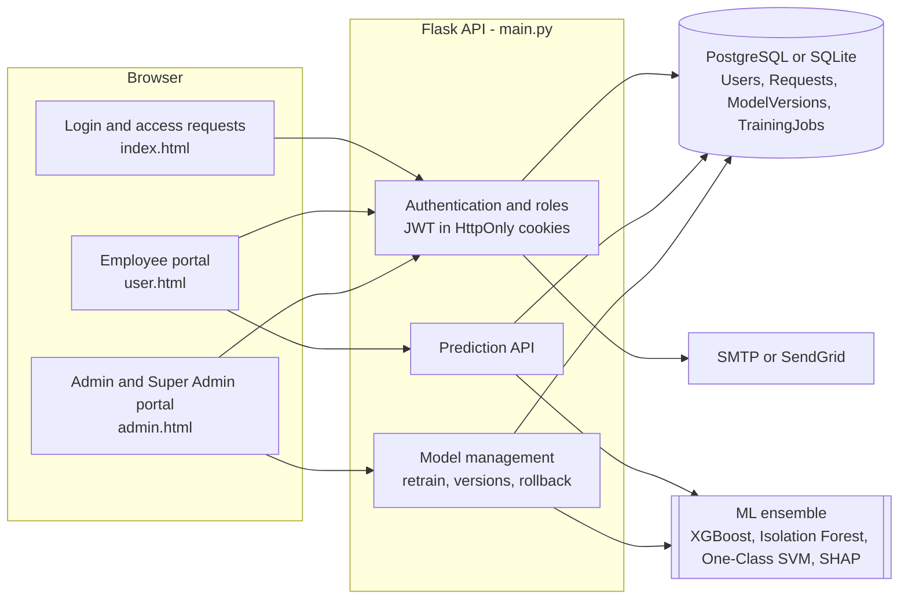
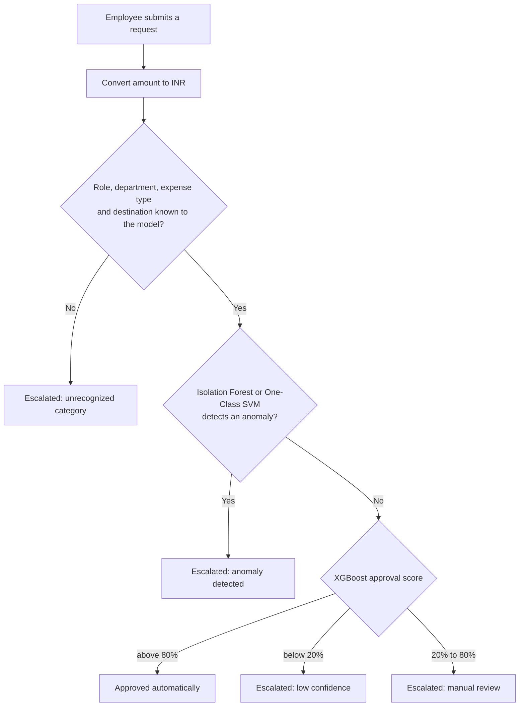
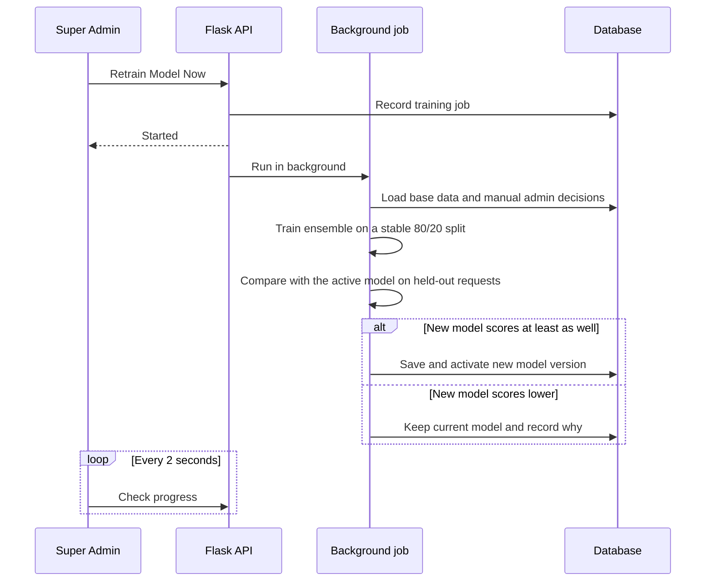
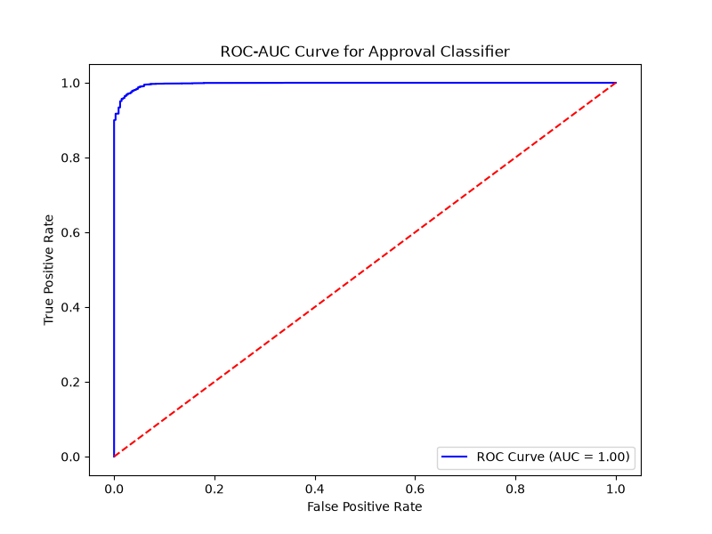

# Advanced Approval Management System (AAMS)

**AI-assisted expense and travel approvals for organizations.** Employees submit requests, a machine-learning ensemble approves the clear-cut ones in real time and escalates anything risky or unfamiliar, administrators review the grey areas, and a Super Admin can retrain the model from those human decisions with a single click.


> [!IMPORTANT]
> **Proprietary software of [Neuzem](https://neuzem.com). All rights reserved.**
> This repository is confidential and intended only for people Neuzem has authorized. No license is granted to download, clone, copy, run, modify, deploy or distribute any part of it without prior written permission from Neuzem. See [License](#license).

---

## Why AAMS

Manual approval queues are slow, and fully automated rules are brittle. AAMS combines both:

- **Instant decisions for routine requests.** A trained classifier auto-approves requests that closely match historically approved spending.
- **Human review where it matters.** Unusual amounts, anomalous patterns, low-confidence scores and never-seen-before categories are escalated to administrators with the reason attached.
- **A model that keeps learning.** Every manual approval or rejection becomes training data. Retraining runs from the admin console, and a new model only goes live if it performs at least as well as the current one.

## Features

### Employees
- Submit expense and travel requests with guided dropdowns for role, department, expense type and destination, or enter a value that is not listed
- Amounts in INR, USD, EUR, GBP or SGD, normalized to INR for scoring
- Instant outcome: auto-approved, or sent for manual review
- Track pending, approved and disapproved requests with CSV, PDF and print export
- Manage profile details and request a password reset

### Administrators
- Live dashboard with approval rate, status distribution and expense-type charts
- Review escalated requests with the AI confidence score and escalation reason
- Approve, reject or move decisions back to pending, with filters by department, expense type and role
- Approve or reject employee access requests and remove employee accounts

### Super Admins
- Everything administrators can do, plus approving administrator accounts
- **ML Agent console**
  - One-click retraining with live progress steps
  - An automatic quality check before any new model goes live
  - Version history with one-click rollback
  - An overview of the active model and how many admin decisions it has not learned from yet

### Platform
- Clean, responsive interface that works from phone to desktop and respects reduced-motion, reduced-transparency and high-contrast preferences
- Email notifications for access requests, approvals, account setup and password resets
- Works with local SQLite out of the box and PostgreSQL in production, with tables created and upgraded automatically on startup

## How it works

### Architecture



### How a request is decided



Each prediction also produces SHAP values that show which fields pushed the score up or down.

### How the model learns from admins



Design choices that make retraining safe to run from a web console:

- **Only human decisions are learned from.** Automatic AI approvals are excluded, so the model never reinforces its own mistakes. Manual decisions are weighted more heavily than base data.
- **Fair comparisons.** Each record is assigned to training or evaluation by a stable hash, so a model is never scored on data it was trained on.
- **Versions live in the database.** Retrained models survive redeploys, every server process switches to the active version within 30 seconds, and any earlier version can be restored.
- **New vocabulary is learned automatically.** When an admin decides a request with a new job role or expense type, the next retrain adds it to the model and to the employee form.

## Model performance

Bundled model, evaluated on 4,635 held-out records it was not trained on:

| Metric | Score |
| --- | --- |
| ROC-AUC | 0.9975 |
| Accuracy | 99.1% |
| F1-score | 0.9954 |

On the same records the confidence thresholds route **92.1%** of requests to automatic approval, **6.0%** to low-confidence escalation and **1.9%** to manual review.



> The base dataset combines synthetic corporate expense records with a public loan-approval dataset mapped to the same schema. These scores describe that benchmark. Accuracy on a specific organization's requests improves as admins make decisions and the model is retrained.

## Roles and permissions

| Capability | Employee | Admin | Super Admin |
| --- | :---: | :---: | :---: |
| Submit requests and view own history | Yes | | |
| View all requests and dashboard | | Yes | Yes |
| Approve, reject or reopen requests | | Yes | Yes |
| Approve employee access requests | | Yes | Yes |
| Remove employee accounts | | Yes | Yes |
| Approve administrator access requests | | | Yes |
| Remove administrator accounts | | | Yes |
| Retrain the model, view versions and roll back | | | Yes |

**Account lifecycle:** a person requests access, an administrator approves it, the person receives a single-use setup link by email, sets a password, and can then log in.

## Tech stack

| Layer | Technologies |
| --- | --- |
| Backend | Flask 3.1, Flask-JWT-Extended, Flask-Limiter, Flask-CORS, Gunicorn |
| Machine learning | XGBoost, scikit-learn (Isolation Forest, One-Class SVM), SHAP, pandas, NumPy, joblib |
| Data | PostgreSQL in production, SQLite for local development |
| Frontend | React 18, DataTables, Chart.js, SweetAlert2, Font Awesome |
| Email | SMTP or the SendGrid HTTP API |

## Project structure

```text
advanced-approval-system/
├── main.py                    # Flask app: auth, requests, prediction and model-management APIs
├── model_pipeline.py          # Shared training, evaluation and quality-check logic
├── train_ensemble_model.py    # CLI: build the bundled model from the base dataset
├── generate_approval_data.py  # CLI: generate the synthetic corporate expense dataset
├── prepare_real_data.py       # CLI: merge synthetic data with a public loan-approval dataset
├── email_service.py           # Transactional emails sent in background threads
├── ensemble_ai_model.pkl      # Bundled model with encoders, base training data and metrics
├── index.html                 # Login, access requests, account setup and password reset
├── user.html                  # Employee portal
├── admin.html                 # Admin and Super Admin portal, including the ML Agent console
├── styles.css                 # Shared design system
├── roc_auc_curve.png          # ROC curve of the bundled model
├── requirements.txt
└── .env.example
```

## Development setup (authorized team members only)

> Access to the source code is restricted to Neuzem team members and parties with written permission from Neuzem. The steps below are internal development instructions and do not grant any right to use the software.

### Prerequisites
- Python 3.11 or newer
- Repository access granted by Neuzem

### Run locally

From the project folder, create a virtual environment:

```bash
python -m venv .venv
```

Activate the virtual environment (`.venv\Scripts\activate` on Windows, `source .venv/bin/activate` on macOS or Linux), then:

```bash
pip install -r requirements.txt
cp .env.example .env
python main.py
```

On Windows Command Prompt use `copy .env.example .env` instead of `cp`. Open **http://localhost:5000**.

### Run the tests

```bash
pip install -r requirements-dev.txt
python -m pytest
```

Tests always use a temporary SQLite database with email delivery disabled, whatever your `.env` contains.

On first start the app creates its database tables and a Super Admin account using the credentials from your environment settings. Configure email (SMTP or SendGrid) to receive the account setup links that new users need. Without it, emails are only logged to the console.

### Configuration

Settings are read from environment variables or a `.env` file. See [`.env.example`](.env.example) for a template.

| Variable | When needed | Purpose |
| --- | --- | --- |
| `JWT_SECRET_KEY` | Production | Signs login sessions. Without it a random key is generated and sessions reset on every restart. |
| `JWT_ACCESS_TOKEN_HOURS` | Optional | Session length in hours. Default `8`. |
| `DATABASE_URL` | Production | PostgreSQL connection string. When unset, a local SQLite file is used. |
| `SQLITE_PATH` | Optional | Path of the local SQLite file. Default `auth.db`. |
| `INITIAL_SUPER_ADMIN_EMAIL` | First start | Email of the Super Admin created on first start. No account is created when it is unset. |
| `INITIAL_SUPER_ADMIN_PASSWORD` or `SUPER_ADMIN_PASSWORD` | First start | Password for that Super Admin account. |
| `SMTP_HOST`, `SMTP_PORT`, `SMTP_USERNAME`, `SMTP_PASSWORD` | For email | SMTP delivery. A Gmail app password works. |
| `SENDGRID_API_KEY` | Optional | Send email through SendGrid's HTTP API, useful on hosts that block SMTP. |
| `FROM_EMAIL`, `FROM_NAME` | Optional | Sender address and display name. |
| `APP_BASE_URL` | Production | Public URL used in setup and reset links. |
| `CORS_ORIGINS` | Optional | Comma-separated origins allowed to call the API. Default `http://localhost:5000`. |
| `ENVIRONMENT` | Optional | Set to `production` to force secure cookies. This is automatic on Render. |

## Rebuilding the base model (optional)

Day-to-day retraining happens in the **ML Agent** console. The command-line scripts are only needed to rebuild the bundled base model from scratch:

```bash
python generate_approval_data.py
python prepare_real_data.py
python train_ensemble_model.py
```

- `generate_approval_data.py` writes `corporate_approval_data.csv` with 20,000 synthetic requests.
- `prepare_real_data.py` expects a public loan-approval dataset at `Datasets/HuggingFace Datasets/master-loan-approval-data.csv` (not included) and writes `combined_corporate_approval_data.csv`.
- `train_ensemble_model.py` writes `ensemble_ai_model.pkl` and, if `matplotlib` is installed, `roc_auc_curve.png`.

## Deployment

Production deployments are managed by Neuzem. For internal reference, AAMS runs on any Python web host, such as Render with a managed PostgreSQL database.

1. Create a PostgreSQL database and copy its connection string.
2. Create a web service from this repository.
   - Build command: `pip install -r requirements.txt`
   - Start command: `gunicorn main:app`
3. Set the environment variables: `JWT_SECRET_KEY`, `DATABASE_URL`, `APP_BASE_URL`, `CORS_ORIGINS`, your email settings, and the Super Admin credentials.
4. Deploy. Database tables are created and upgraded automatically on startup.

Retrained model versions are stored in the database, so they persist across deployments.

## API reference

<details>
<summary>Authentication and accounts</summary>

| Method | Endpoint | Access | Description |
| --- | --- | --- | --- |
| POST | `/api/auth/login` | Public, 5/min | Log in and receive a session cookie |
| POST | `/api/auth/logout` | Public | Clear the session cookie |
| POST | `/api/auth/request_access` | Public, 5/hour | Request an employee or administrator account |
| POST | `/api/auth/setup_password` | Setup link, 10/hour | Set the first password from an emailed setup link |
| POST | `/api/auth/request_password_reset` | Public, 3/hour | Email a reset link, or a fresh setup link if setup is incomplete |
| POST | `/api/auth/reset_password` | Reset link | Set a new password |
| GET | `/api/auth/reject_reset` | Reset link | Cancel a password reset request |
| GET | `/api/auth/get_profile` | Signed in | Current user's profile |
| POST | `/api/auth/update_profile` | Signed in | Update name and employee ID |

</details>

<details>
<summary>Requests and predictions</summary>

| Method | Endpoint | Access | Description |
| --- | --- | --- | --- |
| POST | `/api/predict` | Signed in, 20/min | Score and record a new request |
| GET | `/api/model/form_options` | Signed in | Values the model recognizes, used by the request form |
| GET | `/api/auth/my_requests` | Signed in | Current user's requests |
| GET | `/api/auth/all_requests` | Admin | All requests |
| GET | `/api/auth/pending_approval_requests` | Admin | Escalated requests |
| POST | `/api/auth/approve_request` | Admin | Approve a request |
| POST | `/api/auth/reject_request` | Admin | Reject a request |
| POST | `/api/auth/reopen_request` | Admin | Move a decided request back to pending |

</details>

<details>
<summary>User management</summary>

| Method | Endpoint | Access | Description |
| --- | --- | --- | --- |
| GET | `/api/auth/users` | Admin | All user accounts |
| GET | `/api/auth/pending_users` | Admin | Accounts awaiting approval |
| POST | `/api/auth/approve_user` | Admin (Super Admin for administrators) | Approve an access request and email a setup link |
| POST | `/api/auth/reject_user` | Admin (Super Admin for administrators) | Reject an access request |
| POST | `/api/auth/delete_user` | Admin (Super Admin for administrators) | Remove an account |

</details>

<details>
<summary>Model management</summary>

| Method | Endpoint | Access | Description |
| --- | --- | --- | --- |
| GET | `/api/model/info` | Super Admin | Active model, quality score and pending admin decisions |
| POST | `/api/model/retrain` | Super Admin, 10/hour | Start a background retraining job |
| GET | `/api/model/jobs/latest` | Super Admin | Progress and result of the latest job |
| GET | `/api/model/versions` | Super Admin | Stored model versions and the bundled original |
| POST | `/api/model/activate` | Super Admin | Switch to a stored version, or `null` for the original model |

</details>

## Security

- Sessions use JWTs in HttpOnly, SameSite cookies, marked Secure in production, and logging out clears them on the server
- Every administrative action is authorized on the server by role. Administrators cannot manage other administrators, and nobody can delete their own account.
- Account setup and password reset use single-use, expiring links whose tokens are stored only as SHA-256 hashes
- Passwords are salted and hashed with Werkzeug and must be at least 8 characters
- Rate limiting protects login, registration, password reset, prediction and retraining, and it sees real client IPs behind Render's proxy
- Server-side validation covers email format, currencies and amounts. User-supplied text is escaped in emails and rendered as plain text in dialogs.
- Internal errors are logged on the server, and clients only receive generic messages

## Known limitations

- Exchange rates are fixed values in `main.py` rather than a live feed.
- The frontend compiles JSX in the browser for zero-build simplicity. A bundler would improve load time for large deployments.
- The automated test suite is small so far and covers database setup and organization assignment.

## License

**Proprietary. Copyright © 2026 Neuzem. All rights reserved.**

This software, including its source code, trained models, documentation and design, is confidential and the exclusive property of Neuzem. No license or right is granted, by implication or otherwise, to download, clone, copy, install, run, modify, deploy, sublicense or distribute any part of it without prior written permission from Neuzem.

For demonstrations, evaluations or licensing enquiries, contact Neuzem through [neuzem.com](https://neuzem.com).

## Ownership

Developed by **Mithilesh** ([@Mithilesh017](https://github.com/Mithilesh017)) for **[Neuzem](https://neuzem.com)**.
